# Milestone 2: Where in the Whoniverse?

<figure>
    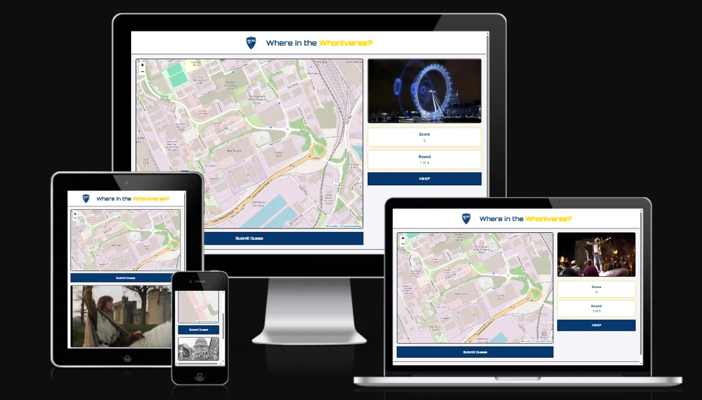
</figure>

## WELCOME TO WHERE IN THE WHONIVERSE?

This is an interactive front-end project using HTML, CSS and Javascript developed as part of the Code Institute Level 5 Diploma in Web Application Development.

The purpose of this website is to provide an interactive, location guessing game based on the BBC Series Doctor Who. The website will challenge users to identify iconic filming locations across the Earth powered by real world map data. 

You can view the deployed game here [Where in the Whoniverse?](https://mrsg33k.github.io/CI-MS2-Whoniverse/)

---

## CONTENTS

* [User Experience](#user-experience-ux)
  * [User Stories](#user-stories)

* [Design](#design)
  * [Colour Scheme](#colour-scheme)
  * [Typography](#typography)
  * [Imagery](#imagery)
  * [Wireframes](#wireframes)

* [Features](#features)
  * [General Features on Each Page](#general-features-on-each-page)
  * [Future Implementations](#future-implementations)
  * [Accessibility](#accessibility)

* [Technologies Used](#technologies-used)
  * [Languages Used](#languages-used)
  * [Frameworks, Libraries & Programs Used](#frameworks-libraries--programs-used)

* [Deployment & Local Development](#deployment--local-development)
  * [Deployment](#deployment)
  * [Local Development](#local-development)
    * [How to Fork](#how-to-fork)
    * [How to Clone](#how-to-clone)

* [Testing](#testing)
  * [Solved Bugs](#solved-bugs)
  * [Known Bugs](#known-bugs)

* [Credits](#credits)
  * [Code Used](#code-used)
  * [Content](#content)
  * [Media](#media)
  * [Acknowledgments](#acknowledgments)

---

## User Experience (UX)

### User Stories

#### First Time Visitor goals
* As a First Time Visitor, I want to see a clear 'How to Play' guide when the page loads so that I can understand the game mechanics before starting my first round.

* As a First Time Visitor, I want to be able to easily identify the guess map and the 'Submit' button so that I can play the game without confusion.

* As a First Time Visitor accessing the site on my phone, I want the interface to stack vertically so that all the interactive elements remain accessible and nothing is obscured.

* As a First Time Visitor, I want to see a summary of my distance from the target and a calculated score after each guess. 

#### Returning Visitor goals
* As a Returning Visitor, I want a 'Play again' button that resets the game state and picks a new random location.

* As a Returning Visitor, I want the game to feel different each time, by providing a range of different locations for me to guess the location of.

* As a Returning Visitor, I want the game to remember my "Theme" settings so that the app feels personalised to me every time I return.

## Design

### Colour Scheme

Because this project is based on Doctor Who I wanted to incorporate the colour palette of Doctor Who without completely copywriting the branding and trademark. 
 
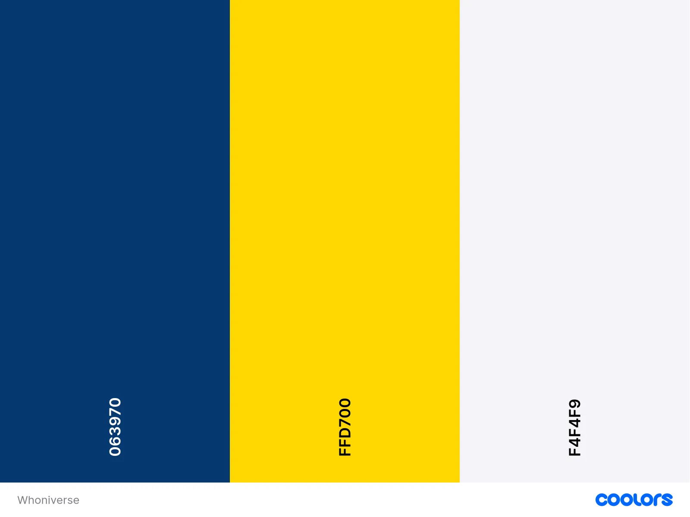
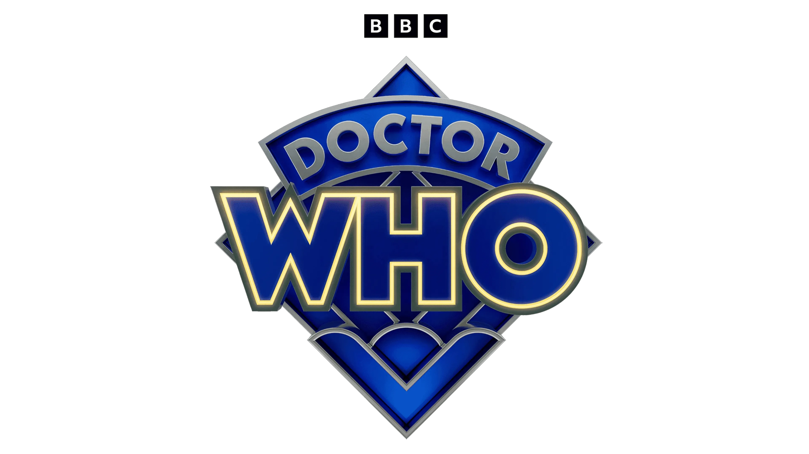
 
 
 
 
 
 
 
 
 
 
I used [coolors](https://coolors.co/) to create my colour palette.
These colours have been used in the following way:
* I have used `#063970` as the text colour, the button background.
* I have used `#FFD700` as an accent colour. It is used as a Hover effect on the buttons and to emphasise the 'Whoniverse' in the title. 
* I have used `#F4F4F9` as the background. I chose this off white colour as it is less harsh on the eye compared to using `#FFF`
* I have used `#000` for the borders on the project

For this project I used CSS styles for colours throughout the project. Instead of hard-coding hex codes in the various styles I declared the colour palette as global variables in the `root:` selector. This made sense for many reasons, primarily because the colours need only be declared once. Any follow up changes or tweaks to colours can be made in one place and updated throughout.

By using `var` to insert the value of a variable it also means I can give them semantic meaning. So instead of a variety of different Hex code, I instead have `var(--accent-colour)` which is brilliant for readability throughout.  

Initially I was going to implement a dark/light mode toggle and whilst this is now moved to a future development, by using the variables it would be easy to swap the values under a different class rather than write additional CSS to accommodate the different light/dark mode colours.  

### Typography

I used [Google Fonts](https://fonts.google.com/) for this project. 

* For headings / titles I used <strong>Orbitron</strong>. I chose this font because it's a sans-serif font with a futuristic look. In the same way as the colours, I didn't want any copyright / trademark infringement so steered away from fan fonts. 

  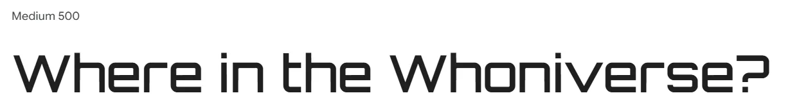
  

   
* For the main text, I wanted to include a sans serif font for readability. I also wanted it to have a slightly futuristic look and so I used <strong>Roboto</strong>. 

   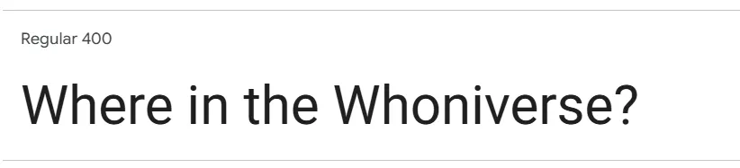

### Imagery

* Logo - For the logo, I wanted to merge together the idea of the TARDIS and a standard Map Pin. I wanted to keep it nice and simple, so the focus is on the game, rather than the logo. 
   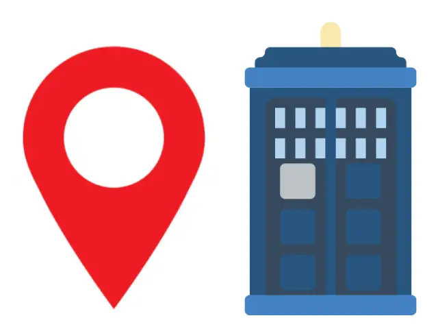
 
 
 
 
 
 

* Locations - For the locations, I wanted to find still images from iconic locations in Doctor Who to use as a visual clue for the player. 

* 404 Page - For the 404,  I have always liked a funny picture on a 404 page. I liked the idea of a broken down TARDIS or something like that as a visual clue to the user that something has gone wrong. 

### Wireframes
Wireframes were created using [Canva](https://www.canva.com)

#### ON PAGE LOAD

#### Desktop
<figure>
    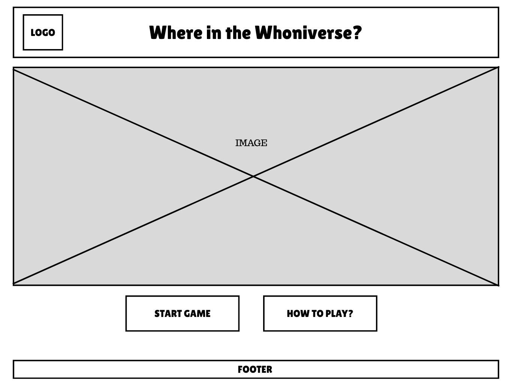
    <figcaption>This shows how the app will load on desktop with two clear buttons "Start Game" and "How to Play"</figcaption>
</figure>

#### Mobile
<figure>
    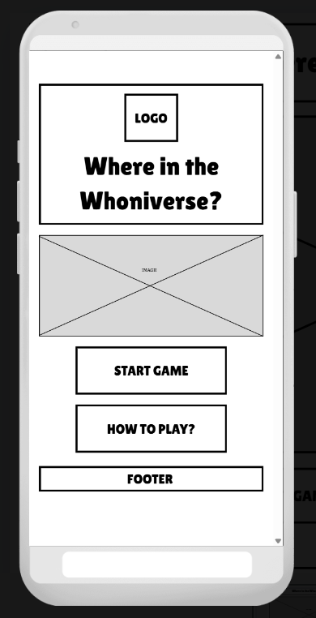
    <figcaption>This shows how the app will load on mobile using vertical stacking with two clear buttons "Start Game" and "How to Play"</figcaption>
</figure>

#### PLAYING THE GAME

#### Desktop
<figure>
    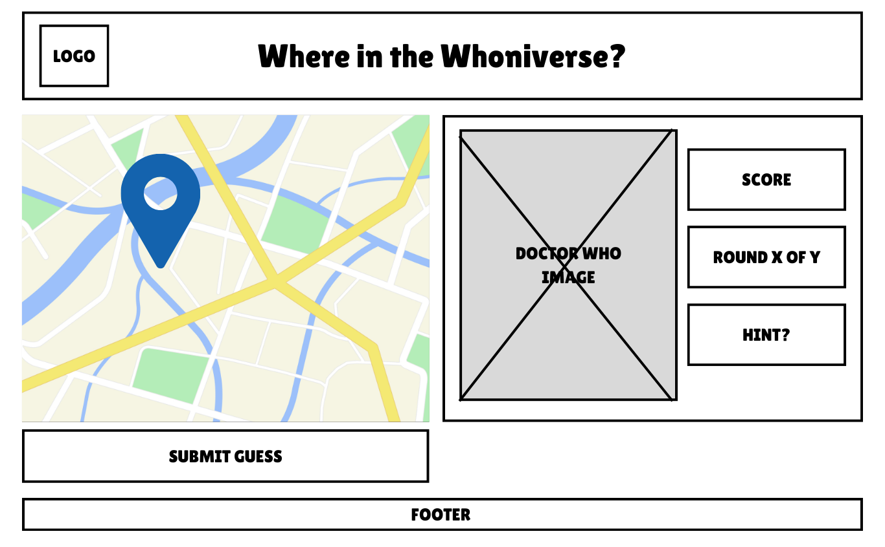
    <figcaption>This shows how the app will appear in 'play' mode, with the map on the left and all buttons/scoring on the right"</figcaption>
</figure>

#### Mobile
<figure>
    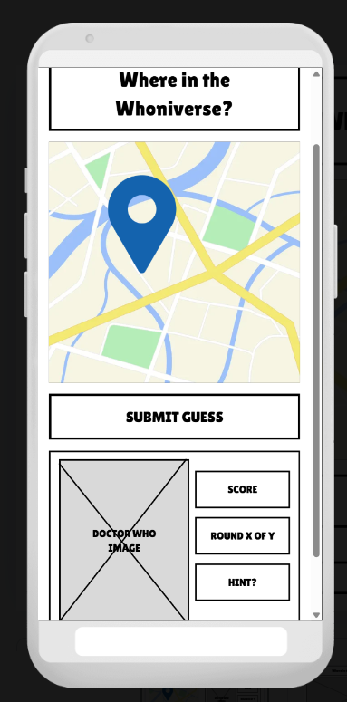
    <figcaption>This shows how the app will appear in 'play' mode" keeping the map on the top of the stack and keeping buttons 'thumb friendly' for users on mobile.</figcaption>
</figure>

#### RESULTS DISPLAY
#### Desktop
<figure>
    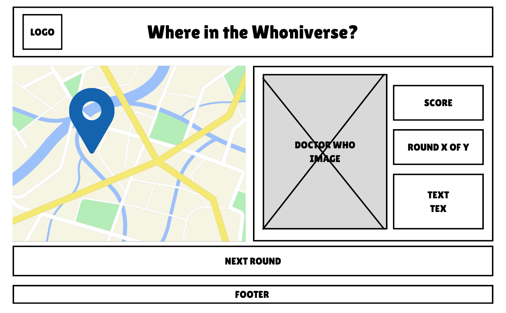
    <figcaption>This shows how the app will appear in 'results' mode, keeping consistent, with the map on the left and all buttons/scoring on the right"</figcaption>
</figure>

#### Mobile
<figure>
    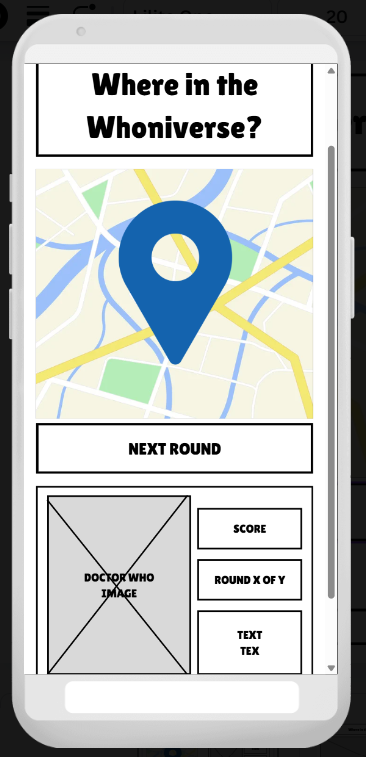
    <figcaption>This shows how the app will appear in 'results' mode" keeping the map on the top of the stack and keeping buttons 'thumb friendly' for users on mobile.</figcaption>
</figure>

## Features
Where in the Whoniverse comprises the following pages:
* index.html - Allowing the user to start the game, or learn how to play
* game.html - The game itself 
* 404.html - If the user requests a webpage that cannot be found, with a redirect to the homepage. 

### General features on each page

Each page has the following consistent features:

#### Favicon
Each page has a a favicon version of the TARDIS pin logo. This gives the website a professional look and reinforces the brand. 
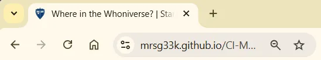
#### index.html

#### Logo / Header
Each page has a consistent header section containing the TARDIS pin logo and a stylised header with the name of the game <strong>Where in the Whoniverse?</strong>. The logo and the header both provide a link back to the homepage.
 

#### Footer
Each page has a simple but consistent footer which contains copyright information and a disclaimer that the website is not affiliated with BBC or Doctor Who. 
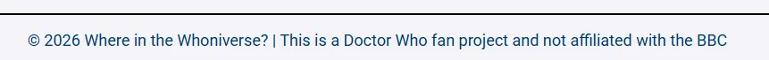

### Index.html
The index / home page features the header, an image I created featuring a world map, a pin marker and a TARDIS followed by two clear buttons "Start Adventure" and "How to Play". The aim was to keep it simple, so users could quickly understand what to do. 
 
 

 

* Start Adventure - Clicking the Start Adventure button will take the user to the game.html page. 
* How to Play - Clicking the How To Play button will open up the modal which explains how to play the game. 
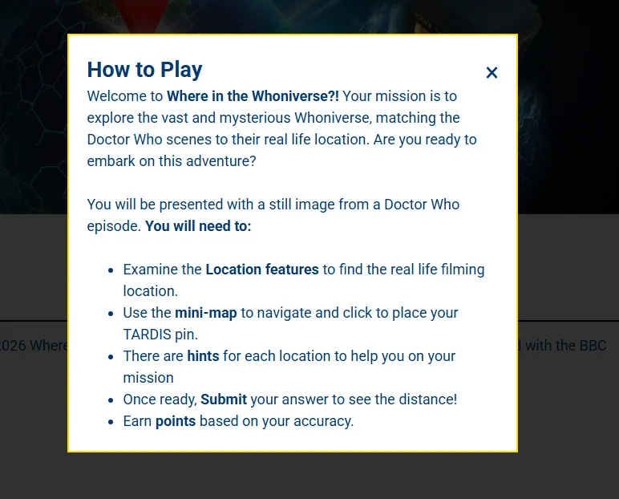

### Game.html
The game page displays the following components:
* The left hand grid (Taking up 2/3rds) - Map - which will always default to Bad Wolf Studios in Cardiff
* The right hand grid (Taking up 1/3rd) 
  * The location image - A randomised choice of 10 location images
  * A score box which updates each round
  * A round X of X box which updats each round
  * A hint button which will provide a modal pop up with a hint to solve the location. 
 
 

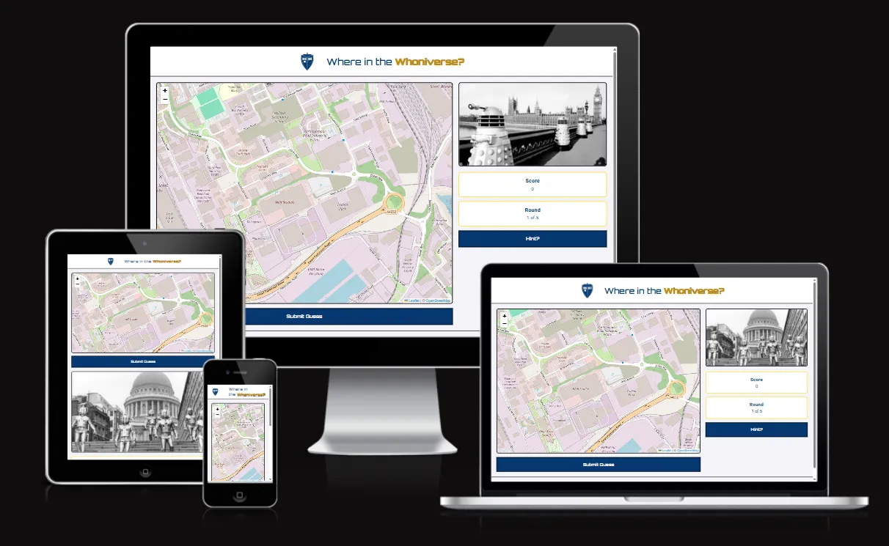
 

#### The Map 
<figure>
    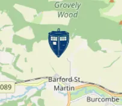
    <figcaption>This shows the TARDIS marker pin being placed at a location on the map</figcaption>
</figure>
To enhance the game immersion, I replaced the default Leaflet marker with a custom TARDIS-pin SVG. I adjusted the iconAnchor properties to ensure the 'landing' point of the TARDIS correctly aligns with the user's geographic coordinates.
 
 

#### The Hint Modal
The hint button takes the hint text from locations.json to display a line of text which will give the user additional help to find the location.
<figure>
    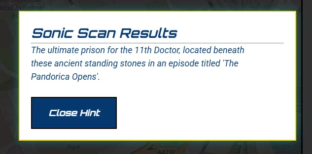
    <figcaption>The hint modal will pop up on click and give the user extra help to find the location</figcaption>
</figure>
 
 

#### The Submit Button
The submit button has a built in check to ensure the user doesn't accidentally click submit before adding a marker on the map. If the user does submit before adding a marker the following modal will activate. 
<figure>
    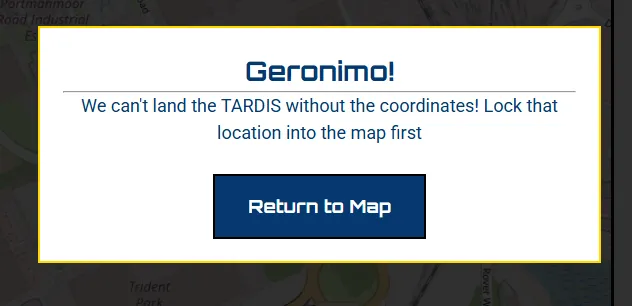
    <figcaption>The error modal pop up if a user submits before adding a marker</figcaption>
</figure>
 
 
When a user clicks the submit button after placing a pin marker. A calculation based on the leaflet.js built in functionality will work out the distance between where they clicked and the co-ordinates provided in the locations.json file. It will then calculate a score and present these to the user, with an option to progress to the next round. 
<figure>
    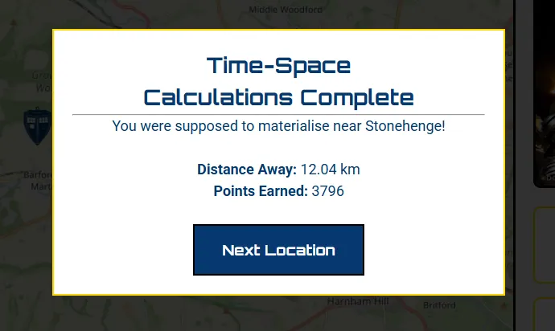
    <figcaption>The submit modal will provide feedback to the user on where the location is, how far away they were from it and how many points they are going to get.</figcaption>
</figure>

#### 404.html
The 404 page acts as a seamless user experience, if a user were to navigate to a non existent URL instead of seeing a standard browswer error they will instead see a themed 404 page with a button navigating back to the index.html page. I implemented a CSS on hover effect with the TARDIS image just for "fun". I was thinking along the lines of the dinosaur game you get on browswers. Just a small bit of entertainment for the user.

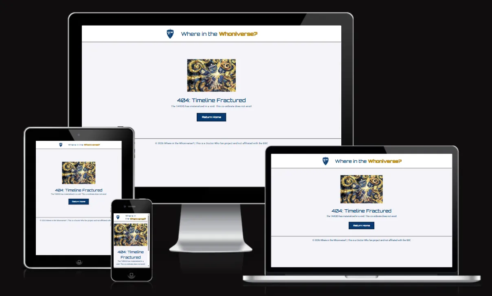

### Future Implementations

* I initially wanted to build the project with a light/dark mode toggle. As part of my research into this, I stumbled across using global variables for the colour scheme, which I have kept. I soon found myself getting sidetracked and spending a lot of time on the toggle and couldn't quite get it right, so decided to shelf it for this project and add it as a future development.

* I would like to add the ability to save a players highest score for each game, and have a global leaderboard. I think this would encourage players to want to keep trying to get a higher score to reach the leaderboard.

* In the interests of time, I limited this project to 10 locations. I would like to expand this further to include more variety in the playability of the game, but would also like to add a skill level. There are so many Doctor Who filming locations with some being a lot trickier, so adding a Hard / Expert mode would be a fun addition to the game. 

### Accessibility

Throughout this project I have aspired to make it as accessible as possible. 
#### Design
I deliberately chose a clean, high-contrast design throughout the project. The off white background colour is easier on the eye to the viewer. Using minimal colours throughout the project will aid players with visual impairments. 

The UI has been built using a mobile-first approach. It features large touch targets at all interaction points and a responsive header that scales to ensure that the gameplay content remains 'above the fold' on smaller screens. 

The game flow is designed with clear exit points 'Play Again' and 'Return to Menu' as well as the header providing a clickable link back to the homepage. Intuitive feedback is given to the player such as the distance calculations and score summaries. The aim is to ensure that players of all abilities can navigate the game with ease. 

### Coding
I have used semantic HTML and ARIA labels throughout to support those using assistive technologies and screen readers. This will be particularly helpful for the interactive elements, navigation and the modals. 

| Element      | ARIA Attribute | Purpose   |
| ----------- | ----------- | ----------- |
| Modals     | `role="dialog`       | Identifies the pop up as a separate interactive window      |
| Stats Cards   | `aria-live="polite`       | Automatically announces the score/round changes to visually impaired users       |
| Close Buttons   | `aria-label`        | Replaces the X symbol with clear close instructions        | 
| Game Map   | `role="application"`        | Signals that the map is an interactive tool rather than a static image       |           

## Technologies Used

### Languages Used

* HTML5
* CSS
* Javascript (I chose to use Native JavaScript over JQuery to ensure high performance, reduce external dependencies, and demonstrate a deeper understanding of DOM manipulation.)

### Frameworks, Libraries & Programs Used

* [Canva](https://www.canva.com/online-whiteboard/wireframes/) - Used to create wireframes.

* [Git](https://git-scm.com/) - For version control.

* [Github](https://github.com/) - To save and store the files for the website.

* [VS Code](https://code.visualstudio.com/) - IDE used to create the site.

* [Google Fonts](https://fonts.google.com/) - Google fonts were used to import the 'Orbitron' and the 'Roboto' font into the project.

* [To WebP](https://towebp.io/) - Used to convert images to WebP format.

* [Photopea](https://www.photopea.com/) - Used to edit and create graphics for the project

* [Favicon.io](https://favicon.io/) - Used to create the favicon based on the logo

* [Leaflet.js](https://leafletjs.com/) - Used to create the map and manage user input to the map

## Deployment & Local Development

### Deployment

### GitHub Pages

The project was deployed to GitHub Pages using the following steps...

1. Log in to GitHub and locate the [GitHub Repository](https://github.com/)
2. At the top of the Repository (not top of page), locate the "Settings" Button on the menu.
3. Scroll down the Settings page until you locate the "GitHub Pages" Section.
4. Under "Source", click the dropdown called "None" and select "Master Branch".
5. The page will automatically refresh.
6. Scroll back down through the page to locate the now published site [link](https://github.com) in the "GitHub Pages" section.

### Forking the GitHub Repository

By forking the GitHub Repository we make a copy of the original repository on our GitHub account to view and/or make changes without affecting the original repository by using the following steps...

1. Log in to GitHub and locate the [GitHub Repository](https://github.com/)
2. At the top of the Repository (not top of page) just above the "Settings" Button on the menu, locate the "Fork" Button.
3. You should now have a copy of the original repository in your GitHub account.

## Testing
Please refer to [TESTING.md](TESTING.md) file for all testing carried out.

### Solved Bugs / Issues

| No | Feature | Issue | Fix |
| :--- | :--- | :--- | :--- |
| 1 | Landing page | The buttons on the landing page had the same BG and text colour rendering the button text unviewable in its current state. 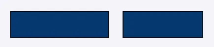 | Updated root values in CSS style to add a button text color of white to contrast the Tardis blue. |
| 2 | Logo | When adding the logo to the placeholder, it appeared to be displaying with a black border on it. 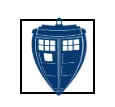 | Needed to tweak the CSS code to remove the 2px border that was originally added for the logo placeholder text. |
| 3 | Game Page | After adding the initial JS code, the mystery image was not loading with a null error on the console.  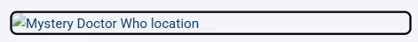 | The issue arose because the script was looking for the modal btn which isn't on the game page. I decided to split the JS into two files, for ease of organisation and debugging during the project.|
| 4 | Game Page | After adding the initial JS code, the mystery image was not loading with a 404 error on the console.   | This was an issue with the locations.json file - I accidentally coded the images as JPG rather than WEBP.|
| 5 | Game Page | At the end of the game, there is an opportunity to play a new game, but no other issue. Essentially trapping the user unless they want to play another game.  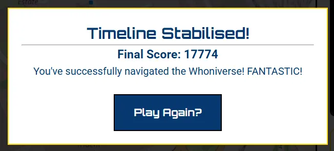 | I added an additional button to the modal to display only at the end of the game, to allow users to return to the homepage.|
| 6 | Image Load - Github Pages | After deploying the site to Github Pages the location images and the Tardis map pin were not loading  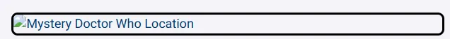 . The console on Chrome developer tools was also showing a 404 error that it could not find the file. 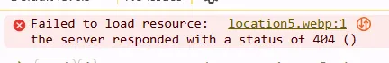 | I checked the images were in the repository and the path was correct, which it was. I then searched on Github community and Stack Overflow where it was suggested to add a "./" at the front of the file path so I did this for each of the paths in locations.json and the game.js link to the Tardis Pin.|
| 7 | End game - Mobile | When reaching the end of the game on mobile devices the "New Game" and "Return to Menu" buttons slightly overlapped. 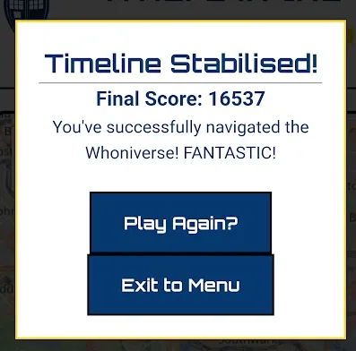  | I added a new media query that added extra spacing between the buttons on mobile screens leaving a much more thumb friendly gap between the two. 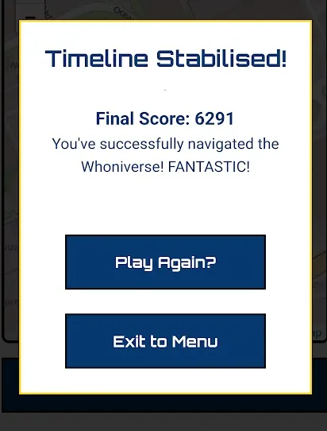|

## Credits

### Code Used

[W3 Schools](https://www.w3schools.com/Js/js_project_modal_popup.asp) Tutorial on how to use HTML and Javascript to create the modal popups. 

[Leaflet.js](https://leafletjs.com/reference.html) Javascript library for using the Open Source Maps

### Content

- [Doctor Who Locations](https://www.doctorwholocations.net/locations/list): Information about the Doctor Who filming locations

###  Media

- [Flaticon ](https://www.flaticon.com/free-icon/maps-and-flags_447031?term=map+pin&page=1&position=2&origin=tag&related_id=447031): Image of Map Pin for creating the TARDIS map pin
- [The Noun Project](https://thenounproject.com/browse/icons/term/tardis/) Tardis by Arancha R - The Noun Project (CC BY 3.0) used to created the TARDIS map pin
- [Wikimedia](https://commons.wikimedia.org/wiki/File:TARDIS-trans.png) TARDIS png file CC-BY-SA-2.5 - used to create the landing page image
- [Adobe Stock](https://stock.adobe.com/) The Globe Illuminated by Futuristic Hexagonal Network Design by Gurav - used to create the landing page image
- [Adobe Stock](https://stock.adobe.com/) 3D Realistic Location map pin gps pointer markers vector illustration for destination by Murniati - used to create the landing page image
- [Adobe Stock](https://stock.adobe.com/) Blue Electric Energy Ring with Crackling Aura by Prazis Images - used to create the landing page image
- [Kuriositas](https://www.kuriositas.com/2013/02/daleks-cross-westminster-bridge-in.html) Daleks crossing Westminister Bridge
- [Movie Maps](https://moviemaps.org/images/wvo) Image of TARDIS outside Roald Dahl Plass 
- [Movie Maps](https://moviemaps.org/images/x8g) Image of Bad Wolf Bay
- [Movie Maps](https://moviemaps.org/images/2i8) Image of The London Eye
- [Tardis Fandom](https://tardis.fandom.com/wiki/The_Gherkin) Image of the Gherkin
- [Dr Who Locations](https://www.doctorwholocations.ne) Image of Bodiam Castle 
- [Blogtor Who](https://www.blogtorwho.com/on-this-day-in-1968-the-cybermen-invaded-london/) Cybermen invasion image
- [DoctorWho.tv](https://www.doctorwho.tv/news-and-features/the-tardis-lands-at-stonehenge-for-doctor-who-day) Doctor Who at Stonehenge
[DoctorWho.tv](https://www.doctorwhotv.co.uk/who-mysteries-the-ducks-31769.htm) Image of Leadworth 
[Wales Online](https://www.walesonline.co.uk/news/local-news/bbc-search-lost-doctor-who-2547874)Image of Abominable Snowman
[Tardis Fandom](https://tardis.fandom.com/wiki/The_Pandorica_Opens) Pandorica Opens - Expanding TARDIS Image
[https://shields.io/](https://shields.io/) - To create the badges on the README introduction

  
###  Acknowledgments

A huge thank you to my husband Mike Whittaker he was a pivotal support during the project, firstly as a huge Doctor Who fan and for introducing me to Doctor Who in the first place. He has played this game an unnatural number of times to help iron out bugs and fixes early on and suggested changes to improve it as I developed the game. 

Thank you to [Syn](https://github.com/synmux) for their support with Github / Gitlab when my account got restricted and I couldn't do anything within Github!