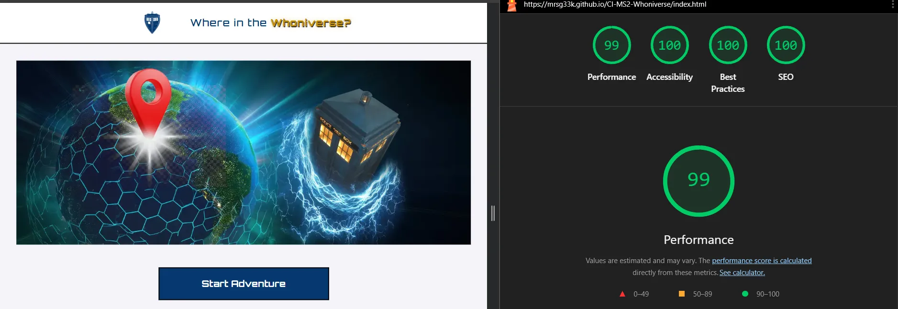
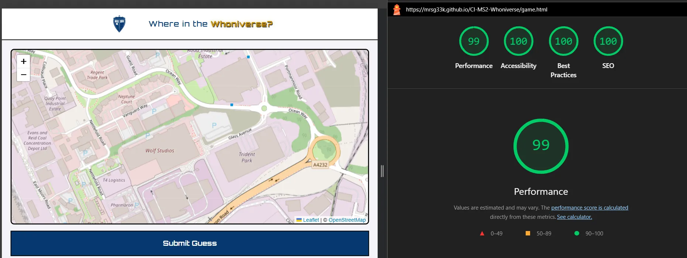
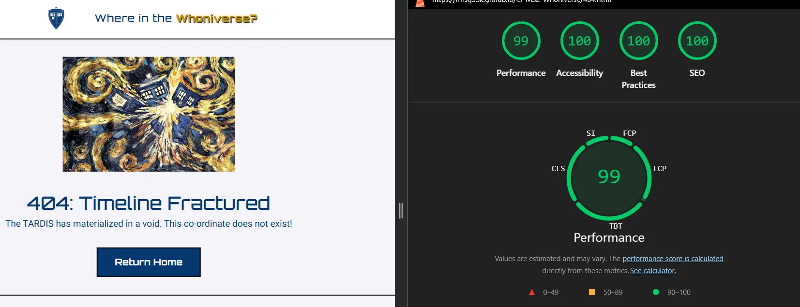
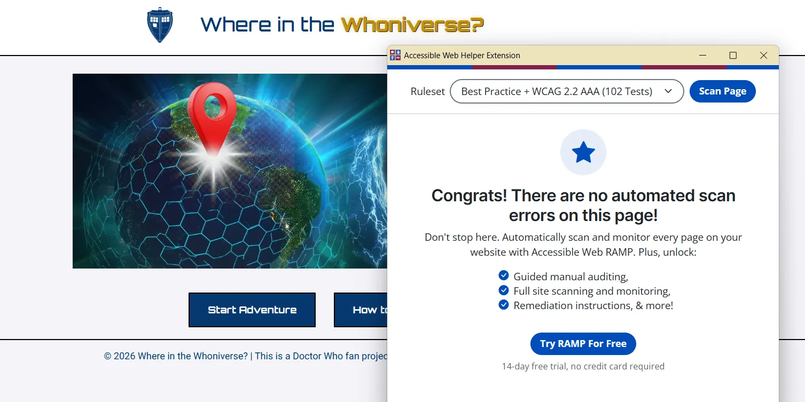
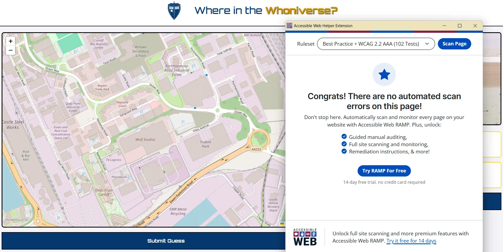
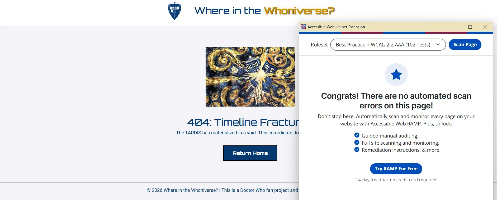

# Where in the Whoniverse -  Testing

<figure>
    
</figure>

You can view the deployed game here [Where in the Whoniverse?](https://mrsg33k.github.io/CI-MS2-Whoniverse/)

- - -

## CONTENTS

* [AUTOMATED TESTING](#automated-testing)
  * [W3C Validator](#w3c-validator)
  * [JavaScript Validator](#javascript-validator)
  * [Lighthouse](#lighthouse)
  * [Accessible Web](#accessile-web)
* [MANUAL TESTING](#manual-testing)
  * [Testing User Stories](#testing-user-stories)
  * [Full Testing](#full-testing)

Testing was ongoing throughout the entire build. I utilised Chrome developer tools whilst building to pinpoint and troubleshoot any issues as I went along.

I utilised the console in the developer tools to work through small sections of JavaScript and ensure that the code was working, and also to troubleshoot where issues were.

- - -

## AUTOMATED TESTING

### W3C Validator

[W3C](https://validator.w3.org/) was used to validate the HTML on all pages of the website. It was also used to validate the CSS.

* [index.html](assets/images/w3cindex.webp) - Passed.
* [game.html](assets/images/w3cgame.webp) - Passed.
* [404.html](assets/images/w3c404.webp) - Passed.
* [style.css](assets/images/w3ccss.webp) - Passed.

- - -

### JavaScript Validator

[jshint](https://jshint.com/) was used to validate the JavaScript.

* [index.js](assets/images/jshintindex.webp) - Passed.
* [game.js](assets/images/jshintgame.webp) - Passed.

- - -

### Lighthouse

I used Lighthouse within the Chrome Developer Tools to test the performance, accessibility, best practices and SEO of the website.

### Desktop Results

All pages of the site are achieving an average score of 99 across the categories. Based on the initial scores, I added a meta description to each of the pages to raise the SEO score. 

#### index.html
<figure>
    
</figure>

#### Game.html

<figure>
    
</figure>

#### 404.html
<figure>
    
</figure>

### Accessible Web
Accessible web extension was used to check the website. All pages passed the full check.

#### Index.html
<figure>
    
</figure>

#### Game.html
<figure>
    
</figure>

#### 404.html
<figure>
    
</figure>

- - -

## MANUAL TESTING

### Testing User Stories

`First Time Visitors`

| Goals | How are they achieved? |
| :--- | :--- |
| As a First Time Visitor, I want to see a clear 'How to Play' guide when the page loads so that I can understand the game mechanics before starting my first round. | On landing on the webpage the user is presented with a "How to Play" button which displays instructions for playing the game. |
| As a First Time Visitor, I want to be able to easily identify the guess map and the 'Submit' button so that I can play the game without confusion | The map is the focal point of game.html taking up 2/3 of the space. The submit button is a large button that is visible to users on desktop and mobile.|
| As a First Time Visitor accessing the site on my phone, I want the interface to stack vertically so that all the interactive elements remain accessible and nothing is obscured. | All elements stack on mobile, with the map being on top, followed by the location image and then the submit button. The header also reduces in size to maximise the element display. |

`Returning Visitors`

|  Goals | How are they achieved? |
| :--- | :--- |
| As a Returning Visitor, I want a 'Play again' button that resets the game state and picks a new random location. | Once a user has completed the game they are presented with the option to start a new game |
| As a Returning Visitor, I want the game to feel different each time, by providing a range of different locations for me to guess the location of. | There are 5 rounds per game, and 10 locations in total. The game will prevent the same location being chosen twice. Future developments will add to the number of locations. |
| As a Returning Visitor, I want a 'Play again' button that resets the game state and picks a new random location. | Once a user has completed the game they are presented with the option to start a new game |
| As a Returning Visitor, I want the game to remember my "Theme" settings so that the app feels personalised to me every time I return.  | This part wasn't achieved in the project. I wanted to include a dark/light mode toggle, but I ended up moving this to future developments instead.  |

- - -

### Full Testing

Full testing was performed on the following devices:

* Laptop:
  * Lenovo Yoga 7i
* Mobile Devices:
  * Samsung S23 Pro
  * Pixel 9a
  * iPhone 14

Each device tested the site using the following browsers:

* Google Chrome
* Safari
* Firefox

Additional testing was taken by friends and family on a variety of devices and screen sizes. 

One issue that was identified was that the how to play modal pop up didn't always scroll when on mobile view. I did recreate this issue and fixed by changing the modal overflow and overscroll in CSS.

<figure>
    
</figure>

#### Home.html

| Feature | Expected Outcome | Testing Performed | Result | Pass/Fail |
| --- | --- | --- | --- | --- |
| The Sites title /logo | Link directs the user back to the home page | Clicked title | Home page reloads | Pass |
| How to play button | Displays the modal with the instructions on how to play the game | Clicked on button | Modal with instructions on how to play opens | Pass |
| Modal close button | Closes the modal | Clicked on close button | Modal closed | Pass |
| Start Adventure | Directs the user to the game page | Clicked on button | Game page opens to display the difficulty selections | Pass |
| All buttons - hover effect | All blue buttons with white text should change to gold buttons with black text on hover | Hover over each button on the page | Each button displayed the correct styling when hovered over | Pass |

#### Game.html

| Feature | Expected Outcome | Testing Performed | Result | Pass/Fail |
| --- | --- | --- | --- | --- |
| The Sites title / logo | Link directs the user back to the home page | Clicked title | Directed back to home page | Pass |
| All buttons - hover effect | All blue buttons with white text should change to gold buttons with black text on hover | Hover over each button on the page | Each button displayed the correct styling when hovered over | Pass |
| Hint Button | Displays the modal with the hint for the location | Clicked on button | Modal with instructions on how to play opens | Pass |
| Modal close button | Closes the modal | Clicked on close button | Modal closed | Pass |
| Map loading | Map loads with Bad Wolf Studios as the location | loaded the game page | Map loaded with Bad Wolf Studios as the location | Pass |
| Submit Button pre marker | Displays the modal explaining you can't submit before placing a marker | Click submit before placing a marker | Modal with instructions opens | Pass |
| Submit Button post marker | Display a modal with the location name, distance from the location and the score | Click submit after placing a marker | Modal with results opens | Pass |
| Score | Score increments after each round | Playing at least one round | Score updated from 0 to the score gained | Pass |
| Round | Round increments from 0 of 5 to 1 of 5 until it reaches 5 | Playing at least one round | Round updated from 0 of 5 to 1 of 5 | Pass |

#### Game.html - End of game

| Feature | Expected Outcome | Testing Performed | Result | Pass/Fail |
| --- | --- | --- | --- | --- |
| End of Round 5 modal | After round 5 the modal should give you a total score and button to play another game | Completed 5 rounds | Modal opened with total score and button to play another game | Pass |
| New Game 'Play Again?' | On clicking 'Play Again?' the score / rounds should reset and map go back to default state | Play 5 rounds and click 'Play Again?' at end | Game reset score to 0, rounds to 0 and map reset | Pass |
| New Game 'Exit to Menu' | On clicking 'Exit to Menu' the player is taken back to index.html | Play 5 rounds and click 'Exit to Menu' at end | index.html loads | Pass |

 

#### 404 Error Page

| Feature | Expected Outcome | Testing Performed | Result | Pass/Fail |
| --- | --- | --- | --- | --- |
| The Sites title / logo | Link directs the user back to the home page | Clicked title | Directed back to home page | Pass |
| All buttons - hover effect | All blue buttons with white text should change to gold buttons with black text on hover | Hover over each button on the page | Each button displayed the correct styling when hovered over | Pass |
| Hover on image - Desktop| The image rotates and glows | Hovered on image | Image rotated and glowed | Pass |
| Return Home button | Takes the player to index.html | Clicked on button | index.html loaded | Pass |
